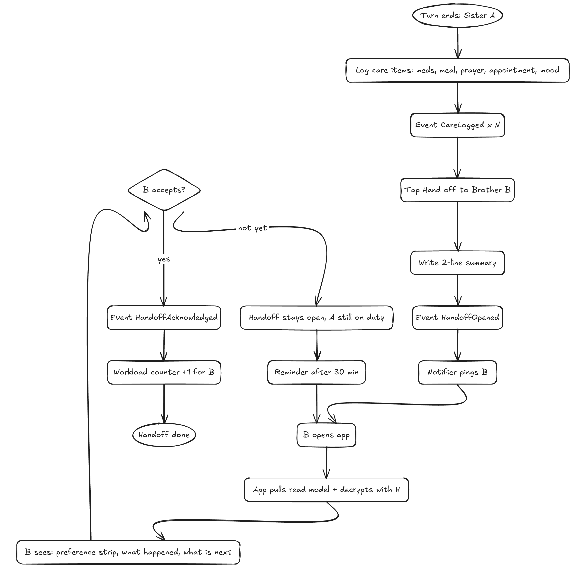
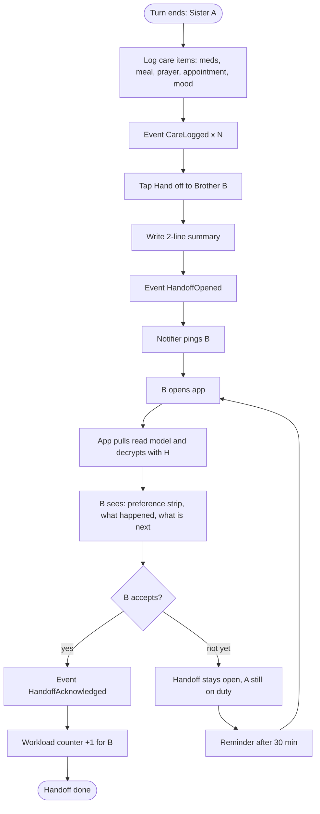
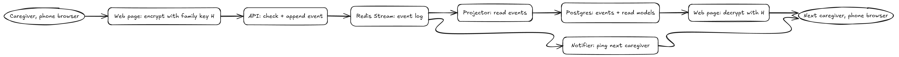
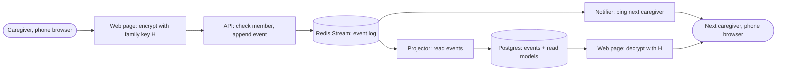
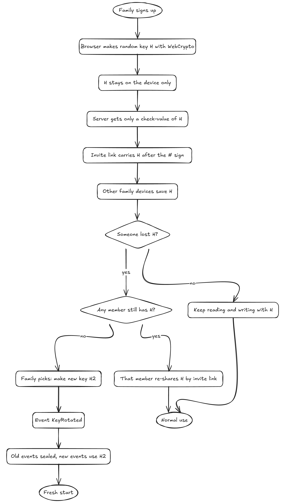
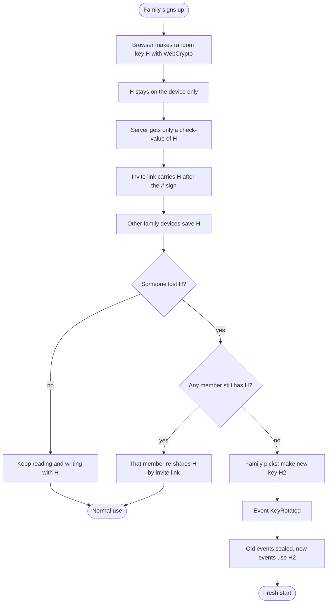
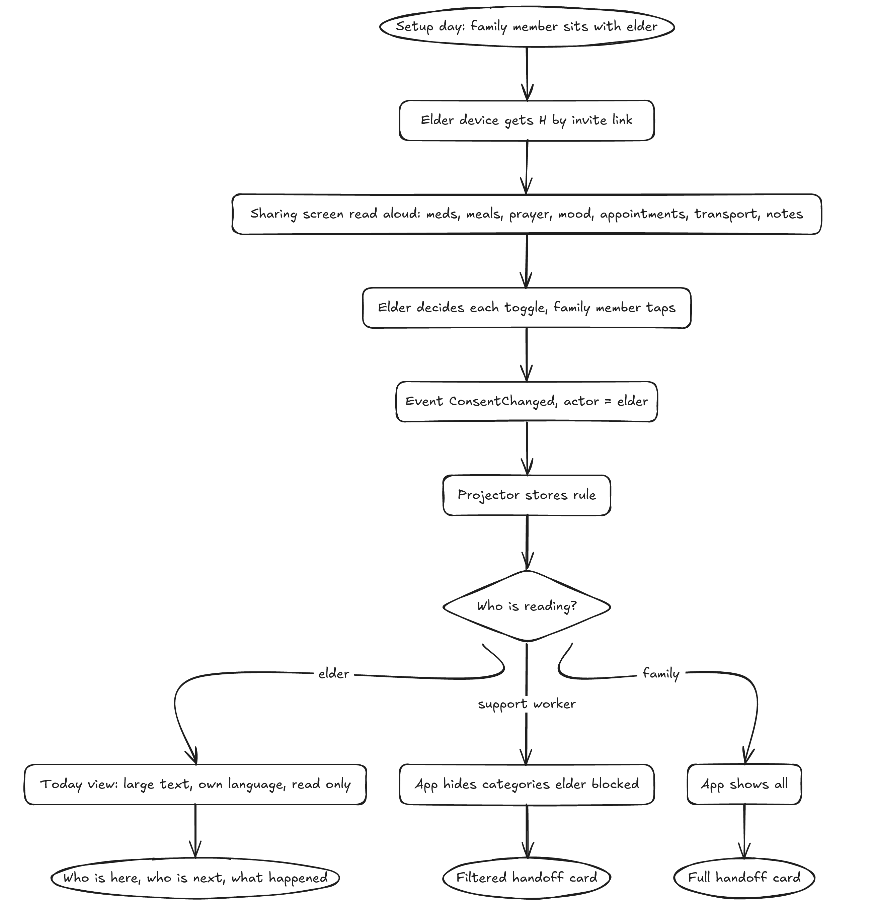
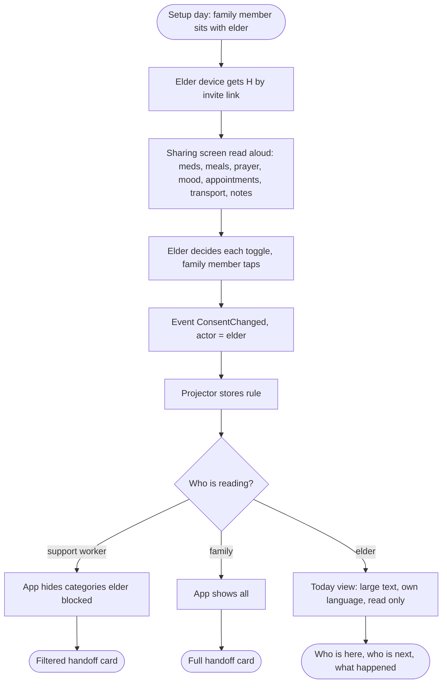
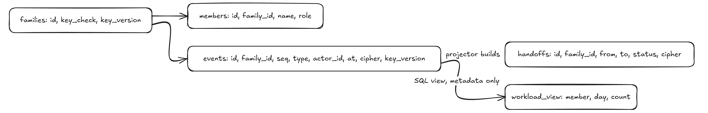
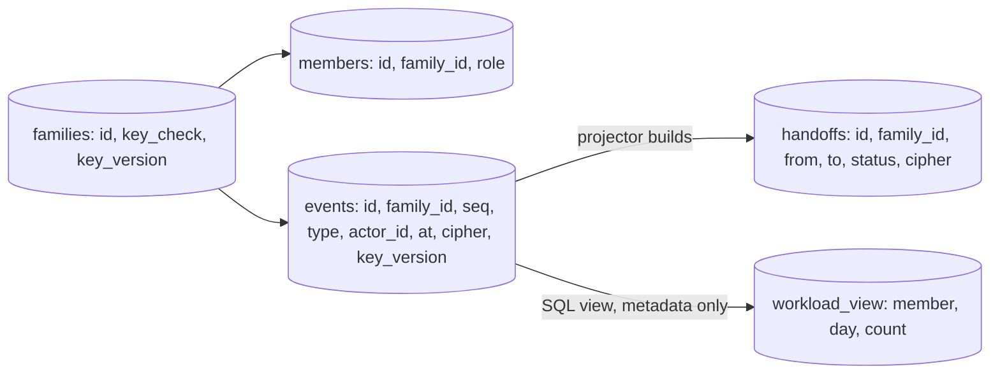

# Amanah Care: Elderly Care handoff, spec for MuslimHacks 2026

Plan only. No app code. Built to demo one workflow tomorrow. Each diagram below ships as a PNG, an .excalidraw file in `diagrams/`, and a Mermaid block you can paste straight into excalidraw.com.

## 1. One-line pitch

A private handoff log for families caring for an elderly parent. Every action is an event. Every event is locked with a key only the family holds. The server, and we as operators, cannot read it.

## 2. Answers to the three "before you build" questions

| Question | Answer |
|---|---|
| Primary user | The adult child finishing a care turn and handing off to the next family member |
| Why better than WhatsApp | WhatsApp is a scroll. Four things it cannot do: a structured card of what happened and what is next, an accept step so nobody assumes the other person read it, an elder-controlled filter on what outsiders see, and a workload count per person. Encryption is table stakes, both have it. Our difference is that we, the operator, hold no key either |
| Who can access data, who controls it | Only devices holding the family key H. The elder controls what outside caregivers see. We hold ciphertext only |

## 3. The one core workflow we demo

Caregiver handoff. Sister A ends her turn on duty, logs care items, hands off to Brother B. B gets pinged, opens the app, sees the decrypted card, accepts. Two browser windows on stage.

Paste into excalidraw.com (More tools, Mermaid to Excalidraw):

Demo script (5 minutes):

1. Window 1: Sister A logs "Fajr prayed", "8am meds given", "breakfast half eaten", "mood: tired".
2. Sister A taps Hand off, picks Brother B, writes "Dhuhr meds at 1pm, physio at 3pm".
3. Window 2: B gets a ping, opens the page, card decrypts in his browser. Top strip shows the elder's preferences (Urdu, no pork or gelatin, female caregiver for personal care, prayer times matter). Below it, the four items and the two next steps.
4. B taps Accept. Workload bar shows A: 3 turns this week, B: 2.
5. Kill switch: open the Postgres table live on the projector. Judges see only ciphertext blobs.

## 4. Platform: web page first, mobile after

MVP ships as a responsive web page opened in the phone browser. Native mobile comes after the hackathon.

| Reason | Web first | Native mobile later |
|---|---|---|
| Demo tomorrow | Two browser windows side by side on one laptop, judges see both sides live | Two phones, screen mirroring, app store or TestFlight, no time |
| Invite link with H after `#` | Works today in every browser, fragment never reaches the server | Deep links need app install first, and the fragment trick needs extra care |
| Crypto | WebCrypto API in every modern browser, AES-GCM built in | Same idea, more plumbing per platform |
| One codebase | One web container in Docker Compose | Two builds, two stores |
| Elder today view | A tablet browser in kiosk mode, large text, no install | Same, plus a home screen icon and push |
| Judges' laptops | They can open the URL themselves during Q and A | They cannot install an app in 5 minutes |

What mobile adds later, in order: push notifications for the handoff ping (SSE in the browser tab does this for the demo), H stored in the secure enclave or keystore instead of browser storage, offline logging with sync when back online, home screen presence for the elder.

Design rule for the web page so the mobile port stays cheap: every screen is one column, thumb-sized buttons, no hover states, phone width first and laptop width second.

## 5. Architecture: everything is an event

Stack you asked for: Redis Streams as the event store, Postgres for durable copy and read models, Docker Compose to run all of it.

Paste into excalidraw.com (More tools, Mermaid to Excalidraw):

Six containers run under Docker Compose, listed here with their jobs.

| Container | Job | Talks to |
|---|---|---|
| web | Responsive web page opened in the phone browser. Holds key H, encrypts before sending and decrypts after fetching | api |
| api | Command handler that checks the caller is a member, appends the event to the Redis Stream and returns 202 | redis, postgres (reads only) |
| projector | Consumer group on the stream that copies each event into Postgres and updates read models | redis, postgres |
| notifier | Consumer group on the stream that pushes a ping to the target member on HandoffOpened, via SSE or web push | redis, web |
| redis | Event store. One stream per family: `family:{id}:events` | |
| postgres | Durable events table + read models | |

Write path: browser encrypts, api validates, `XADD` to stream, done. Read path: browser asks api for the read model, api reads Postgres, browser decrypts.

Short on time: merge notifier into projector. Keep two consumer groups so the split stays honest.

## 6. Event catalogue

Metadata stays in clear so the system can route and count. Content stays encrypted.

| Event | Clear fields | Encrypted payload |
|---|---|---|
| FamilyCreated | family_id, key_check, key_version | elder display name |
| MemberJoined | family_id, member_id, role (elder, family, support) | member name |
| PreferenceSet | family_id, actor_id | language, diet, prayer, modesty, caregiver gender. Rendered as the strip on top of every handoff card, so preferences are seen, never only stored |
| CareLogged | family_id, actor_id, category (meds, meal, prayer, mobility, mood, appointment, transport, note), at | free text, quantities, details |
| HandoffOpened | family_id, from_id, to_id, at | 2-line summary, next steps |
| HandoffAcknowledged | family_id, to_id, handoff_id, at | none |
| ConsentChanged | family_id, actor_id (must be elder), category, audience, allowed | none |
| KeyRotated | family_id, new_key_version, new_key_check | none |

Rules: no dosage suggestions, no diagnosis, no triage anywhere. CareLogged records what a human did. It never advises.

## 7. Privacy model: the family key H

Paste into excalidraw.com (More tools, Mermaid to Excalidraw):

How it works in plain words:

- On signup the browser makes a random 256-bit key with WebCrypto. That is H.
- H never goes to the server. The server stores only a check-value (a hash of H) so a device can prove it holds the right key.
- Every encrypted payload uses AES-GCM with H. The server stores ciphertext plus the key_version used.
- Inviting family: the invite link puts H after the `#` sign. Browsers never send the fragment to the server. The joining browser saves H in local storage on that device.
- Lost H, someone still has it: they send a fresh invite link. Nothing rotates.
- Lost H, nobody has it: the family chooses to make H2. Event KeyRotated. Old ciphertext stays in the log but cannot be opened. New events use H2. Tell the family this clearly on screen before they confirm.

What we as operators can see: family ids, member ids, roles, event types, categories, timestamps, counts. What we cannot see: names, preferences, care notes, handoff summaries. This is how we meet Quebec Law 25 and PIPEDA on health information without a compliance team: we never hold the readable data.

## 8. Elder participation

The elder is a member with H like everyone else. On top, the elder owns the sharing rules.

Paste into excalidraw.com (More tools, Mermaid to Excalidraw):

Only the elder's member_id may emit ConsentChanged, and the api rejects it from anyone else. Once stored by the projector, the rule drives how the web app filters the handoff card by audience before rendering. Support workers get the filtered card. Family gets the full card.

The elder never handles the key or a form alone. Two paths, both without key handling:

| Path | How it works |
|---|---|
| Consent set once, together | During setup a family member sits with the elder. The elder's tablet browser gets H through the invite link, same as everyone. Someone reads the Sharing screen aloud, and for each toggle the elder decides while a family member taps. ConsentChanged events carry the elder's member_id. Done once, changed only when the elder asks |
| Today view, read only | A large-text page on the elder's tablet browser, kiosk mode: who is with me today, who comes next, what happened since morning. Big font, elder's language from PreferenceSet, no buttons besides "call family". Decrypts locally with H saved on the device |

Dignity line for the pitch: the elder sees everything written about them and decides who else sees it.

Honest limit for the hackathon: filtering happens in the reader's browser, and support workers hold the same H. A real product gives support workers a separate scoped key. Say this in the pitch if asked.

## 9. Database: 4 tables, 1 view

Paste into excalidraw.com (More tools, Mermaid to Excalidraw):

| Table | Columns | Notes |
|---|---|---|
| families | id, key_check, key_version, created_at | one row per elder household |
| members | id, family_id, role, joined_at | role: elder, family, support. Name lives encrypted in the MemberJoined event |
| events | id, family_id, seq, type, actor_id, occurred_at, payload_cipher, key_version | durable copy of the Redis stream, append only |
| handoffs | id, family_id, from_id, to_id, status, opened_at, acked_at, summary_cipher | read model built by projector. status: open, acknowledged |
| workload_view | member_id, day, care_count, handoff_count | SQL view over events, metadata only, no ciphertext touched. History of who did what, not a roster of who is next |

Nothing else. Preferences and care items are read straight from events in the browser after decryption. Add a `care_timeline` read model only if the demo feels slow.

## 10. Build order for the 24 hours

| Hour | Do | Done when |
|---|---|---|
| 0 to 2 | docker-compose with redis, postgres, api skeleton. Tables created | `docker compose up` works |
| 2 to 5 | api: POST /events with member check and XADD. projector: consume, insert into events | curl an event, see it in Postgres |
| 5 to 9 | web page: WebCrypto key generation, invite link with `#`, encrypt and decrypt helpers, one-column phone-width layout | two browsers share H, both decrypt a test payload |
| 9 to 13 | PreferenceSet form, CareLogged form, HandoffOpened form, handoffs read model, preference strip on the card | Sister A flow works end to end, strip visible |
| 13 to 16 | notifier ping, HandoffAcknowledged, workload view and bar | Brother B flow works end to end |
| 16 to 18 | Elder consent screen, ConsentChanged, filtered card | toggle hides a category for a support member |
| 18 to 20 | KeyRotated path with the warning screen | lost-key demo works |
| 20 to 22 | Polish, seed data, second device test | dry run passes twice |
| 22 to 24 | Pitch deck from this doc, sleep | Slide 1 carries the three numbers below. Last slide is the real versus mocked list |

Cut list if behind, in this order: KeyRotated screen, consent screen, notifier (poll instead).

## 11. Pitch structure

Open with the guide's own evidence, slide 1:

| Number | Meaning | Source in guide |
|---|---|---|
| 1 in 4 | American Muslims caring for an older adult, against 16% of the general public | EC1, ISPU 2026 |
| 52% | Muslims aged 30 to 49 who care for an elder | EC2, ISPU |
| 18% against 7% | Muslims reporting difficulty finding culturally appropriate caregivers, against the general public | EC1 |

Close with the honesty slide, three columns: works live on stage, mocked for the demo, not built. Fill it from the cut list in section 10 on the morning of the pitch.

Middle of the deck maps each brief focus to one screen:

| Brief focus | Our answer in the demo |
|---|---|
| Caregiver handoffs | The card: preference strip, what happened, what is next, one tap to accept |
| Workload visibility | Count per member from event metadata, zero decryption needed |
| Personal preferences | PreferenceSet event, individual per elder, encrypted |
| Elder participation | Elder-only ConsentChanged event, api enforced. Today view in large text in the elder's language |
| Consent and privacy | Family key H, server holds ciphertext, live table shown to judges |
| No diagnosis or dosage | Events record actions taken by humans. No advice paths exist |
